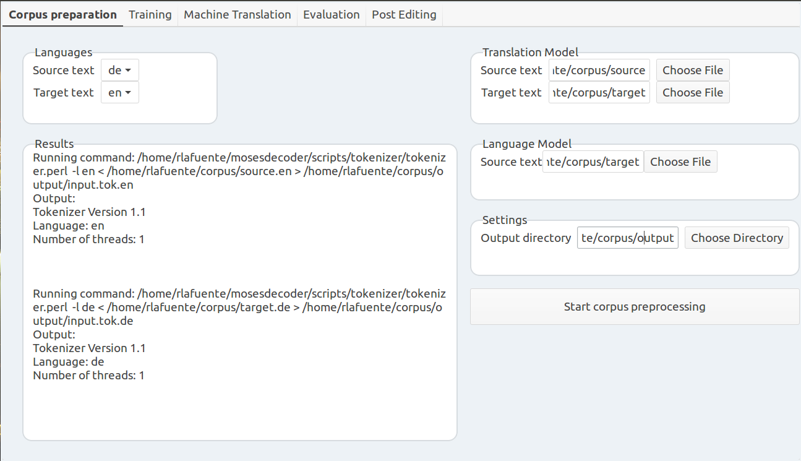

# TTT: Translators' Training Tool


## Machine translation made easy for human translators!
TTT is an under development post-editing suite which aims to improve the translators experience with machine translation tools such as moses. It provides the user with a graphical user interface to:

- Work with the moses machine translation pipeline.
- Apply evaluation metrics such as BLEU.
- Post-edit the obtained machine translation.


### Features

- Portable (Windows / Linux)
- Friendly Graphical User Interface (GUI) for MOSES.
- Use machine translation tool MOSES, post-edit the output and run evaluation metrics.

##### Corpus preparation tab


##### Training tab


### Dependencies

#### Source code

##### About Linux
- You should link /bin/sh to /bin/bash and not to bin dash. To do that:
	- Check the link:
	```
	ls -l /bin/sh
	```
	- If /bin/sh is a link to /bin/dash, change it to /bin/bash.
	```
	sudo mv /bin/sh /bin/sh.orig
	sudo ln -s /bin/bash /bin/sh
	```
This is necessary to use the redirection commands used by MOSES commands.


##### On Ubuntu
- MOSES (Install with "--with-mm" and "--install-scripts" flags)
- To install its dependencies run

	```
	python ubuntu_install.py
	```

##### On Windows using Cygwin
- MOSES (Install with "--with-mm" and "--install-scripts" flags)
- To install Cygwin and its dependencies run

	```
	python cygwin_install.py
	```
##### On Windows
- MOSES (Install with "--with-mm" and "--install-scripts" flags)
- the following installer is recommended:
	[https://sourceforge.net/projects/pygobjectwin32/files/pygi-aio-3.18.2_rev10-setup_84c21bc2679ff32e73de38cbaa6ef6d30c628ae5.exe/download](https://sourceforge.net/projects/pygobjectwin32/files/pygi-aio-3.18.2_rev10-setup_84c21bc2679ff32e73de38cbaa6ef6d30c628ae5.exe/download)

	- visual installation guide:

	

	


#### Binaries (portable)
More details on this soon!


### Status
- Under development. Currently everything is working but we need a better GUI design and add robustness (strict error handling).


### How to use

#### Source code

##### On Linux
Simply install all dependencies and run:
```
python main.py
```
##### On Windows

Run LXDE or any other X window environment from CygWin. From inside LXDE or your favorite one run:

```
python main.py
```

#### Binaries (portable)
More details on this soon!


### Contributors
- Paula Estrella <pestrella at famaf dot unc dot edu dot ar>
- Roxana Lafuente <roxana.lafuente at gmail dot com>
- Miguel Lemos <miguelemosreverte at gmail dot com>

We welcome new contributions! If you would like to be part of the team, create a new pull request and contact Paula or Roxana to let us know. If it is merged into the project you will be added as a contributor.
